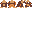
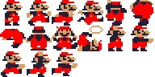
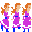
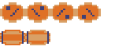
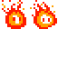
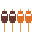

# Donkey Kong - RTM32

  
  
  
  
  
  

## Descripción del juego

Donkey Kong es una reinterpretación del clásico arcade de Nintendo para la arquitectura RTM32. El objetivo es controlar a Jumpman (Mario) y escalar una obra en construcción evadiendo obstáculos para rescatar a su novia Pauline de las garras del gorila gigante Donkey Kong.

## Historia

Jumpman es un carpintero valiente pero común y corriente. Su mascota, un enorme simio llamado **Donkey Kong**, se ha escapado, ha secuestrado a su novia **Pauline** y la ha llevado a lo más alto de una obra en construcción de la ciudad. 

En un acto de furia, Donkey Kong ha comenzado a lanzar barriles por las rampas y vigas metálicas para impedir que alguien se acerque. Jumpman debe armarse de valor, trepar por escaleras inestables, saltar obstáculos mortales y esquivar llamas vivientes para llegar a la cima y salvar al amor de su vida. 

Esto no es solo un trabajo de construcción. Es una misión de rescate en las alturas donde un solo paso en falso significa la derrota.

## Mecánicas del juego

### Controles
El jugador controla a Jumpman desde una vista lateral (plataformas). Se puede correr de izquierda a derecha, saltar para esquivar obstáculos o alcanzar plataformas, y subir o bajar por las escaleras que conectan los distintos niveles de vigas.

### Obstáculos y enemigos
La obra está llena de peligros que harán que tu ascenso sea una pesadilla:

- **Barriles (Barrels)**: Lanzados constantemente por Donkey Kong desde la cima. Ruedan por las rampas y, a veces, caen sorpresivamente por las escaleras. ¡Un toque y estás frito!
- **Llamas Vivientes (Fireballs)**: Enemigos impredecibles que nacen cuando los barriles azules chocan contra el barril de fuego en la base. Se mueven de forma errática por las plataformas y pueden subir escaleras.

Si Jumpman es golpeado por un barril, tocado por el fuego, o cae desde una altura demasiado grande, pierde una vida.

### El Martillo (Hammer)
El recurso más valioso para la defensa. 
- En la pista aparecen martillos flotantes. Si Jumpman salta y agarra uno, entrará en un modo de invencibilidad ofensiva por tiempo limitado.
- **Destrucción**: Con el martillo en mano, Jumpman no puede saltar ni subir escaleras, pero aplastará automáticamente cualquier barril o bola de fuego que se cruce en su camino, sumando jugosos puntos extra.

### Puntuación y progresión
- Los puntos se acumulan al saltar sobre los barriles, destruirlos con el martillo, agarrar los objetos perdidos de Pauline (paraguas, sombreros, bolsos) y al completar la etapa.
- Además de los puntos, hay un temporizador de bonus. Si el tiempo llega a cero, Jumpman pierde una vida. El tiempo restante al terminar la etapa se suma como puntos.
- La dificultad aumenta en cada nivel con barriles más rápidos y más bolas de fuego.

## Las 4 Etapas del Rescate

El ascenso a la cima se divide en 4 etapas clásicas (niveles de altura), cada una con un diseño arquitectónico distinto y desafíos únicos.

### Etapa 1: "25m" (Las Rampas)
El nivel icónico que lo empezó todo. Una estructura en zig-zag de vigas rojas.
- **Entorno**: Vigas torcidas formando rampas. Escaleras que conectan los pisos.
- **Desafío Principal**: Esquivar la lluvia incesante de barriles rodantes y evitar el fuego que nace del tambor en la base.
- **Atmósfera**: Clásica e introductoria, ideal para dominar el salto.

### Etapa 2: "50m" (La Fábrica de Cemento / Cintas Transportadoras)
El nivel de las plataformas móviles (a menudo omitido en versiones de consola, pero presente en el arcade original).
- **Entorno**: Cintas transportadoras que mueven a Jumpman hacia la izquierda o derecha.
- **Desafío Principal**: Evitar los bloques de cemento ardiente que circulan por las cintas y dominar el salto sobre plataformas móviles. Las bolas de fuego son más agresivas.
- **Atmósfera**: Mecánica, rápida e impredecible.

### Etapa 3: "75m" (Los Ascensores)
Un salto al vacío.
- **Entorno**: Dos ejes de ascensores mecánicos que suben y bajan constantemente, acompañados de plataformas estables.
- **Desafío Principal**: Calcular los saltos entre ascensores en movimiento y esquivar los resortes (bouncers) que caen desde la cima sin patrón aparente.
- **Atmósfera**: Tensa y vertiginosa. Un salto mal medido significa una caída letal.

### Etapa 4: "100m" (Los Remaches)
El enfrentamiento final para derrotar a Donkey Kong.
- **Entorno**: Una estructura recta con múltiples pisos soportada por remaches amarillos brillantes.
- **Desafío Principal**: Jumpman debe caminar sobre todos los remaches para quitarlos. Las llamas vivientes lo perseguirán implacablemente.
- **Meta**: Al quitar todos los remaches, la estructura colapsa, Donkey Kong cae al vacío y Pauline es rescatada.

## Sprites

| Sprite | Descripción | Frames |
|--------|-------------|--------|
| **Jumpman (Mario)** | Héroe del juego. Corre, salta, sube escaleras y muere. | 6+ |
| **Donkey Kong** | El antagonista. Se golpea el pecho, tira barriles y hace muecas. | 4+ |
| **Pauline** | La damisela en apuros. Pide auxilio ("HELP!"). | 2+ |
| **Barril (Rodando)** | Principal obstáculo mortal. Rueda por las vigas. | 4 |
| **Llama (Fireball)** | Enemigo errático que persigue a Jumpman. | 2 |
| **Martillo** | Ítem de poder temporal para destruir barriles. | 2 |
| **Objetos (Bonus)** | Sombrilla, sombrero y bolso de Pauline. Dan puntos. | 3 |
| **Vigas y Escaleras** | Elementos estructurales que forman el terreno del nivel. | Varios |

> **Nota:** Todos los sprites originales fueron extraídos y escalados perfectamente a 32x32 píxeles utilizando un algoritmo *Nearest Neighbor* para mantener los bordes duros y nítidos (sin borrosidad/antialiasing) listos para ser renderizados por la CPU.

## Características visuales

- Resolución de pantalla orientada a texturas de **32x32 píxeles** en modo consola/VGA.
- Paleta de colores vibrantes sobre un fondo negro profundo para resaltar la obra nocturna.
- Animaciones clásicas en pixel-art de 8 bits.
- Vista lateral de plataformas estáticas de una sola pantalla (Single-screen platformer).
